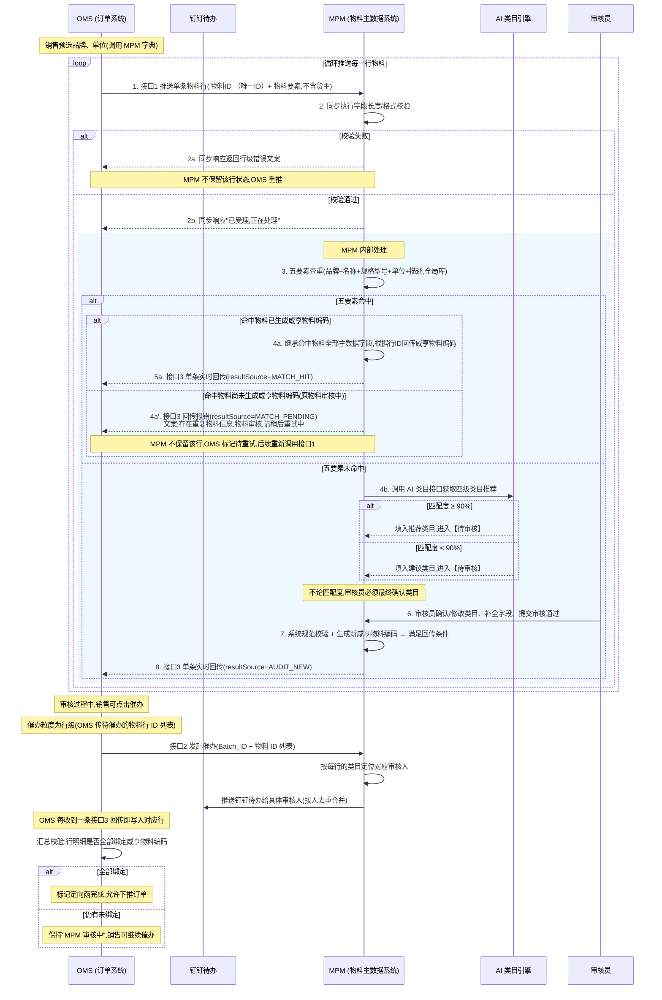

# OMS-MPM 定向采购物料同步及自动化审核需求文档

> **系统链路说明**：本需求中，OMS（订单系统）与 MPM（物料主数据系统）**直接对接**，无中间平台中转。文档中"OMS → MPM"的表述均代表直连调用。
>
> **接口协作核心原则**：OMS 遍历定向函下物料行 → 按行循环调用 MPM 单条推送接口（接口1）→ MPM **同步**完成字段长度/格式校验 →（通过）进入 **MPM 内部处理**（5 要素查重 / AI 类目 / 审核员审核）→ 每行回传条件就绪即**单条实时回传** OMS（接口3）→ OMS 自行汇总判定整单是否完成。

---

## 版本记录

| 版本 | 发布日期 | 变更说明 |
|---|---|---|
| **1.0** | 2026-04-24 | 首版定稿。核心设计:<br>① OMS 按行循环调用 MPM **单条推送接口**(接口1);<br>② MPM **同步**做字段长度/格式校验,失败即同步返错、**MPM 不保留**,由 OMS 重推;<br>③ 校验通过后**MPM 内部处理**进入 **5 要素查重**(品牌+名称+规格型号+单位+描述,不含货主);<br>④ 查重**命中**直接继承主数据、单条实时回传 OMS,不走 AI 类目/人工审核;<br>⑤ 查重**未命中**才调用 AI 类目接口,获取推荐/建议四级类目,**全部由审核员最终确认**;<br>⑥ 审核通过后系统生成新编码,**单条实时回传** OMS(接口3);<br>⑦ **OMS 侧自行汇总**判定整单完成,MPM 不再做整单回传、不再做整单判定;<br>⑧ **催办以行明细为唯一索引**(`Batch_ID + 物料 ID`),`Batch_ID` 不作为催办索引;频率按行级统计(30 分钟 / 每日 6 次);<br>⑨ **OMS 不传货主字段**,MPM 内部货主由 MPM 依据发起人组织/默认规则自动判定;<br>⑩ 原批量推送接口、原整单回传接口、原异步校验失败通知接口(接口4)**整体取消**;<br>⑪ 审核员列表页、详情页等**交互实现不在本版本覆盖**,将在后续独立的交互设计文档中撰写。 |
| **1.1** | 2026-04-27 | 全文订正:① 流程图与全文将"MPM 异步处理(阶段)"统一改为"MPM 同步接口处理"(后于 v1.5 再次订正为"MPM 内部处理");② 命中分支由"自动绑定咸亨物料编码 → 【已完成】"改为"根据物料行 ID 回传咸亨物料编码";相关章节(§3 状态机 / §4 流程图 / §5.2~5.4 / §6 / §9 / §11 接口3)同步对齐。 |
| **1.2** | 2026-04-27 | §11 接口清单新增 **接口 4:【调用】MPM 调用 AI 物料四级分类匹配接口**(`POST /api/workflow/material-category-l4-match/invoke`),含字段映射(MPM 名称→`name`、规格型号+描述→`description`)、请求/响应示例、置信度阈值与异常兜底规则。 |
| **1.3** | 2026-04-27 | §5.3 第三步第 1 点补充审核员交互细节:支持对未匹配/不合适类目**手动选择**,并支持**再次触发接口4** 调用、**弹窗展示** AI 推荐建议与置信度/理由,审核员可一键采用或手动选择(不影响流程图)。 |
| **1.4** | 2026-04-27 | ① §7 钉钉催办「跳转链接」收紧为"具体跳转实现形式在交互设计文档中定义";② §11 接口3 字段表与请求示例新增 **品牌编码**(必填,6 位数字,示例 `023049`);③ §11 接口3「货主」字段只展示**资质编码**(示例 `1025`),请求示例删除 `shipOwnerName`。 |
| **1.5** | 2026-04-27 | PRD 评审后整体订正:<br>① **术语**:全文"进入【已完成】"统一改为"满足回传条件";"MPM 同步接口处理"改为"MPM 内部处理"(接口层"同步响应已受理"保留);<br>② **字段一致性**:接口3 字段表 line 608 表格格式修复;字段表与 JSON 对齐(`minOrderQty`=100/`purchaseDeptCode`=023/`categoryLevel4Code`=02010201/`goodsIdentifier`=01;`计息类型`必填栏改"是");接口1 字段表新增 `applicantId/applicantName/submitTime/sourceSystem` 并显式标注 `brandId/unitId`;<br>③ **多货主收紧**:全文"自动判定"改为"本期固定 1025,后期再支持多货主";<br>④ **新增 §10.1 本期不实现的场景**(7 项边界声明:审核员驳回 / 协同抢占 / 销售改单 / 已完成回滚 / 多货主 / 手动补推 / SLA 升级);<br>⑤ **价格精度**:市场价规则补"四舍五入保留 2 位小数";<br>⑥ **运维补推**:删除 §9/§10/§11 的"运维侧介入手动补推",改为"3 次重试后记录失败告警"。 |
| **1.6** | 2026-04-29 | **五要素命中分支拆分**:补充「命中物料主数据但**尚未生成咸亨物料编码**(即命中物料自身仍处于审核中)」场景。处理规则:<br>① **回传通道**:仍走接口3,新增 `resultSource=MATCH_PENDING`,响应内容只回传错误信息(无 `material` 主体),提示文案统一为「**存在重复物料信息,物料审核,请稍后重试中**」;<br>② **MPM 侧**:不保留该行任何状态(等同同步校验失败的处理),不挂起、不等待原物料审核完成;<br>③ **OMS 侧**:收到 MATCH_PENDING 后,该行回退至「待重试」,由 OMS 按既定策略择机重新调用接口1 推送(行级幂等键释放后允许再次推送);<br>④ 同步更新:§3 状态机新增第 3b 行 / §4 流程图拆分命中子分支 / §5.3 第一步、§6 第二步补充三态分流(命中已编码 / 命中无编码 / 未命中) / §9 增加「命中无编码 → MATCH_PENDING 回传」规则 / §10 增加异常项 / §11 接口3 新增 `MATCH_PENDING` 报文示例。 |

---

## 0. 名词解释

| 名词 | 含义 |
|---|---|
| **Batch_ID / 定向函单号** | OMS 定向函的唯一批次编码，贯穿所有行明细。仅用于数据归属与 OMS 侧整单完成汇总；(催办以行明细为粒度,见第 7 节) |
| **物料 ID / 定向函行号** | OMS 行明细的唯一编码，MPM 侧以 `Batch_ID + 物料 ID` 作为行级幂等键、回传绑定键,也是**催办的唯一索引** |
| **MPM 内部货主** | MPM 系统中物料数据归属的内部主体。**OMS 侧不传货主字段**,**本期固定为 `1025`(万聚国际(杭州)供应链有限公司)**,后期再支持多货主。 |
| **咸亨物料编码** | MPM 系统生成的内部物料唯一编码，用于单条实时回传 OMS 绑定 |
| **四级类目** | MPM 物料分类体系的最细粒度类目，确认后用于读取类目关联的配置字段数据（税收分类、税率、订单执行员等） |
| **五要素** | `品牌 + 名称 + 规格型号 + 单位 + 描述`，作为物料查重的匹配键值，在 MPM 全局物料库做全量检索 |

---

## 1. 业务痛点分析

- **查重颗粒度不足**：传统匹配仅靠名称，易造成"一物多码"，增加库存管理难度。
- **进度不可控**：销售发起申请后无法实时感知 MPM 审核进度，缺乏有效的在线催办机制。
- **数据不一致**：跨系统传输中，单位、品牌等基础维度不统一，导致物料主数据治理混乱。
- **整单回传失真**：原整单回传机制在任一行阻塞时，整单都无法回传，OMS 侧感知迟滞。

---

## 2. 需求概述

本需求旨在通过接口自动化手段，实现 OMS 定向函物料在 MPM 中的**单条推送、同步字段校验、五要素查重、AI 辅助、审核员确认与行级实时回传**。核心原则为：**源头库对齐、查重先行、行级实时、OMS 侧整单汇总**。

通过"查重优先 + AI 辅助类目 + 审核员全量确认"的组合拳，确保物料编码快速、准确地回流至 OMS，支撑销售业务。

---

## 3. 物料行状态机

按**流转路径 × 触发条件 × 两端行状态**的三维结构呈现。每一行物料在 OMS 和 MPM 两个系统中各自维护自己的行级状态,下表描述两者在每个流转事件下的同步关系。

| # | 流转路径 | 触发条件 | OMS 行状态 | MPM 行状态 |
|---|---|---|---|---|
| **1** | **OMS → MPM**<br>(接口1 推送) | 销售提交定向函,OMS 遍历物料行逐条调用接口1 | **已发送,等待同步响应** | **同步校验中**(接收并同步做字段长度/格式校验) |
| **2a** | **MPM → OMS**<br>(接口1 同步响应 - 失败) | 字段长度/格式/字典合法性校验不通过 | **已驳回**,由销售调整字段后**重推该行** | **不保留**(MPM 不落库,不留痕) |
| **2b** | **MPM → OMS**<br>(接口1 同步响应 - 受理) | 字段校验通过,MPM 同步返回 "已受理" | **已受理,等待编码回传** | **MPM 内部处理中**(涵盖五要素查重、AI 类目匹配、审核员确认审核通过整个内部链路) |
| **3** | **MPM(内部流转)**<br>(MPM 内部处理节点) | ① 五要素命中**且命中物料已有咸亨物料编码**,根据物料行 ID 回传咸亨物料编码 或 ② 审核员审核通过并生成新编码 | 继续为"等待编码回传" | **行级已完成**(立即触发接口3 单条回传) |
| **3b** | **MPM → OMS**<br>(接口3 命中无编码报错) | 五要素命中,但**命中物料尚未生成咸亨物料编码**(命中物料自身仍处于审核中) | **待重试**,文案"存在重复物料信息,物料审核,请稍后重试中";由 OMS 按既定策略择机重推 | **不保留**(MPM 不挂起,不等待原物料审核完成,行级幂等键释放) |
| **4** | **MPM → OMS**<br>(接口3 单条实时回传) | 物料行满足回传条件即触发,不等整单 | **已收到编码**,写入订单行明细 | **已回传,行级终态** |
| **5** | **OMS(内部汇总)** | 本 Batch_ID 下所有物料行均已绑定咸亨物料编码 | **定向函已完成**,允许销售下推订单 | —(MPM 侧**不维护整单状态**) |
| **6** | **OMS → MPM**<br>(接口2 催办,独立动作,不改变主状态) | 销售对尚未回传的物料行发起催办(行级索引) | 维持"已受理等待回传",**累计记录该行催办次数** | 维持"MPM 内部处理中",**按行路由审核人并推送钉钉待办**(不改变行级主状态) |

> **说明**:
> 1. 第 2a 行(同步校验失败)是**纯同步响应**,MPM 不保留任何行级状态;OMS 重新填充后重新发起第 1 步。
> 2. 第 3 行是 MPM 内部的状态迁移,不涉及跨系统调用;为了表达简洁,查重/AI 类目/人工审核三条子路径**合并折叠**为"MPM 内部处理"。
> 3. 第 5 行的"定向函已完成"是 **OMS 侧的汇总判定**,由 OMS 根据收齐全部行级编码后自行翻转;MPM 不再做整单完成判定、不再做整单回传。
> 4. 第 6 行催办是**辅助动作**,触发后主状态机保持不变,只是额外触发钉钉推送;催办的详细规则、频率限制、动态路由逻辑见第 7 节。

---

## 4. 业务流程说明 (Mermaid 流程图)



---

## 5. OMS 与 MPM 系统交互全局流程

### 5.1 源头约束（OMS 发起端）

- **标准化录入**：OMS 在填写定向函时，通过 OMS 平台调用 MPM 的基础字典。
  - **品牌**：必须从 MPM 品牌库中选择。
  - **单位**：必须从 MPM 单位库中选择。
- **交互控制**：OMS 端在点击"提交定向函"后，**立即置灰**提交按钮，进入"MPM 审核中"状态，防止重复触发。
- **循环推送**：OMS 遍历定向函下的所有物料行，**对每一行循环调用 MPM 接口1**（单条粒度）。单个定向函预计 200–500 行，OMS 侧应控制并发节奏，避免压垮 MPM。

### 5.2 MPM 接收与同步字段校验（接口1）

- **接口粒度**：MPM 对外开放**单条新增接口**，OMS 按行循环调用。
- **入参**：`Batch_ID` + `物料 ID`（行唯一编码）+ 标准化后的物料要素。**不含货主字段**(货主由 MPM 侧自行判定)。
- **MPM 内部货主判定**:OMS 不传货主。**本期 MPM 内部货主固定为 `1025`(万聚国际(杭州)供应链有限公司)**,不阻断接口1 主流程;后期再支持多货主自动判定。
- **同步校验**：MPM 接收到单行后，**同步执行**字段长度/格式规范校验（如名称/规格型号字符长度、品牌/单位是否在字典内、禁止字符等）。
  - **校验通过**：同步响应"已受理"（`code=200, status=PROCESSING`），随后 MPM 内部处理进入五要素查重流程。
  - **校验失败**：**同步响应**直接返回行级错误文案给 OMS（`code=400`，含 `errors[]` 定位到字段）；**MPM 不保留该行任何状态**，失败即纯粹告知，由 OMS 修正后重推该行。
- **行级幂等**：以 `Batch_ID + 物料 ID` 为幂等键；若该行已在处理中，直接拒绝重复推送并返回提示。

### 5.3 数据匹配与分流（接口1 同步响应"已受理"后MPM 内部处理）

MPM 接口1 同步响应"已受理"后，立即进入MPM 内部处理。**先执行五要素查重，查重未命中才触发 AI 类目匹配**。

#### 第一步：五要素查重

- 系统按 **5 要素**在 MPM 全局物料库中检索：`【品牌 + 名称 + 规格型号 + 单位 + 描述】`（**不含货主**，全局库全量检索）。
- **冲突降级**：若命中多个（概率极低），取**匹配度最高**（或创建时间最新）的一个。
- **命中且命中物料已生成咸亨物料编码**：继承命中物料的咸亨物料编码及全部主数据字段（类目、税收分类、订单执行员等），**无需走 AI 类目/人工审核**，**根据物料行 ID 立即通过接口3 单条实时回传 OMS**（`resultSource=MATCH_HIT`）。
- **命中但命中物料尚未生成咸亨物料编码**（即命中物料自身仍处于【待审核】状态、编码尚未生成）：MPM **不保留**该行任何状态，立即通过接口3 回传错误信息给 OMS（`resultSource=MATCH_PENDING`），统一文案"**存在重复物料信息，物料审核，请稍后重试中**"。OMS 收到后将该行标记为**待重试**，按既定策略择机重新调用接口1 推送（行级幂等键随 MPM 不保留而释放，允许再次推送）。
- **未命中**：数据流转至【待审核】，进入 AI 类目匹配阶段。

#### 第二步：AI 类目匹配（仅未命中路径）

- 系统调用 AI 类目查询接口，获取四级类目推荐值及匹配度。
- **匹配度 ≥ 90%**：系统将推荐类目**预填入**待审核行，等待审核员最终确认。
- **匹配度 < 90%**：系统将建议类目**预填入**待审核行，等待审核员调整/确认。
- **关键规则**：**不论匹配度多少，审核员都必须对类目进行最终确认**，不存在自动采用路径。

#### 第三步：审核员确认与编码生成

- 审核员对处于【待审核】状态的物料行依次完成:
  1. **确认/修改四级类目**：
     - **默认状态**：行内展示接口4 AI 预填的类目（`confidence ≥ 0.90` 为推荐、`< 0.90` 为建议；AI 调用异常时该字段留空）；
     - **手动选择**：针对 **AI 未匹配（类目为空）、AI 建议不合适或审核员认为需要修正** 的物料，审核员**支持手动从四级类目树中选择**任意类目；
     - **再次触发 AI**：审核员可在**详情页**点击【重新获取 AI 建议】按钮，**再次调用接口4** 动态查询最新类目建议（适用于审核员补全/调整名称、规格型号、描述后想重新获取 AI 推荐的场景）；
     - **弹窗展示**：再次触发后，系统以**弹窗**形式展示 AI 返回的推荐类目、对应**置信度**（`confidence`）及判定理由（`reason`），审核员可在弹窗内**一键采用**或**继续手动选择**；弹窗关闭后行内类目按审核员的最终选择回填。
  2. 基于确认后的类目读取配置字段（税收分类、税率、订单执行员、采购部门、产品经理等）并自动赋值；
  3. 补全其他必填项；
  4. 提交审核通过。
- 系统在审核通过时执行校验：
  - **字段规范校验**：对字段长度、格式等进行校验，任何必填项为空则阻断提交；
  - **字段读取逻辑校验**：读取相关配置字段进行逻辑合规校验。
- 校验通过后，系统生成新的咸亨物料编码，数据满足回传条件，**立即通过接口3 单条实时回传 OMS**。

> **交互说明**:审核员使用的列表页、详情页、操作按钮、页面跳转等具体交互本版本不覆盖,将在后续独立的交互设计文档中细化。

### 5.4 单条实时回传（接口3）

- **触发时机**（三个节点均触发）：
  1. 五要素命中**且命中物料已有咸亨物料编码**后，**根据物料行 ID 立即通过接口3 单条回传**（`resultSource=MATCH_HIT`）；
  2. 审核员审核通过，系统生成新编码后 → 该行立即通过接口3 回传（`resultSource=AUDIT_NEW`）；
  3. 五要素命中**但命中物料尚未生成咸亨物料编码**时，立即通过接口3 报错回传（`resultSource=MATCH_PENDING`，文案"存在重复物料信息，物料审核，请稍后重试中"），MPM 不保留该行,由 OMS 标记待重试并自行重推。
- **粒度**：每行物料单独回传一次，不等整单、不做批量。
- **内容**：MATCH_HIT / AUDIT_NEW 回传字段包含咸亨物料编码、类目、税收分类、订单执行员等全量主数据（详见 11.3）；MATCH_PENDING 仅回传错误信息(无 `material` 主体)。

### 5.5 OMS 侧整单完成判定

- OMS 每收到一条接口3 回传，即将 `物料 ID → 咸亨物料编码` 写入 OMS 订单行明细。
- OMS 内部**按行事件触发或周期性地**校验当前定向函下所有物料行是否均已绑定咸亨物料编码：
  - **全部绑定**：OMS 自动将定向函状态翻转为"已完成"，允许销售下推订单；
  - **仍有未绑定**：保持"MPM 审核中"状态，销售可发起催办。
- **MPM 不再做整单完成判定**，不再触发整单回传。

---

## 6. MPM 内部执行业务流程逻辑（五步走）

### 第一步：接口1 同步字段校验（Tier 0）

- **同步校验**：接收单行后立即做字段长度/格式/禁止字符/字典合法性校验。
- **成功**：同步响应"已受理"（`code=200, status=PROCESSING`），MPM 内部处理继续下一步。
- **失败**：同步响应错误文案（`code=400`，含 `errors[]`），**MPM 不保留任何状态**，OMS 修正后重推该行。

### 第二步：五要素查重（Tier 1）

- **逻辑**：系统以 `【品牌 + 名称 + 规格型号 + 单位 + 描述】` 为键值，在 MPM 全局物料库中检索（**不含货主**）。
- **冲突处理**：若命中 ≥ 2 个编码，系统自动关联**匹配度最高**（或最新使用）的一个。
- **命中且命中物料已生成咸亨物料编码**：
  - 继承命中物料的咸亨物料编码及全部主数据字段；
  - **根据物料行 ID 立即通过接口3 单条回传咸亨物料编码**（`resultSource=MATCH_HIT`），无需审核员介入、无需走 AI 类目。
- **命中但命中物料尚未生成咸亨物料编码**（命中物料自身仍处于【待审核】，编码尚未生成）：
  - MPM **不保留**该行任何状态、不挂起、不等待原物料审核完成；
  - 立即通过接口3 回传错误信息（`resultSource=MATCH_PENDING`），统一文案"**存在重复物料信息，物料审核，请稍后重试中**"；
  - OMS 收到后标记该行为**待重试**，按既定策略择机重新调用接口1 推送（行级幂等键已释放）。
- **未命中**：数据流转至【待审核】，进入 AI 类目匹配阶段。

### 第三步：AI 类目匹配（Tier 2，仅未命中路径）

- **AI 预判**：调用 AI 类目查询接口，根据名称、规格型号、描述等信息获取推荐四级类目及匹配度。
- **≥ 90%**：将推荐类目预填入待审核行；
- **< 90%**：将建议类目预填入待审核行；
- **核心规则**：**两种情况下，审核员都必须人工确认类目**，不存在自动采用路径。
- **AI 异常**：AI 接口调用失败时，系统记录日志，类目字段留空，交审核员手动选择，不阻断流程。

### 第四步：人工审核与编码新增（Tier 3）

- **审核对象**:审核员处理所有处于【待审核】状态的物料行(对应为五要素未命中的物料)。
- **处理动作**：审核员确认/修改四级类目 → 系统依据类目读取配置字段并自动赋值 → 审核员补全其他必填字段 → 提交审核通过。
- **系统校验（审核通过时执行）**：
  - 字段规范校验：对字段长度、格式等进行规范校验，必填项缺失则**强行阻断**提交并高亮报错；
  - 字段读取逻辑校验：读取相关配置字段进行逻辑合规校验。
- **终态赋码**：校验通过后生成新的咸亨物料编码，数据满足回传条件。

> **交互说明**:审核员的列表页、筛选器、批量操作、详情页等具体交互形态本版本不覆盖,将在后续独立的交互设计文档中细化。

> **说明**：本期不实现【自动智能审核】/【自动执行】路径，所有未命中物料均需审核员手动审核通过。

### 第五步：行级实时回传（Tier 4）

- **写入关系表**：每一行满足回传条件时，立即将 `定向函行号（物料 ID） → 咸亨物料编码` 写入关系表；若该行已有旧值，**直接覆盖**，不做冲突拦截。
- **单条实时回传**：每行满足回传条件时立即触发接口3 单条回传 OMS，**不等整单**：
  - 命中路径：查重命中后即刻回传；
  - 审核路径：审核通过后即刻回传。
- **MPM 不做整单判定**：整单是否完成由 OMS 根据已收到的单条回传自行统计。

---

## 📝 7. 催办钉钉待办(行级索引)

如果定向函物料没有收到完整物料编码，OMS 可发起催办（接口2）。**催办的唯一索引是物料行(物料 ID),不是 Batch_ID**;Batch_ID 仅作为数据归属上下文传入,便于 MPM 定位行集合。MPM 侧**按待办物料行动态路由**审核人,通过钉钉待办推送强提醒。

- **索引粒度**:**催办以行明细为唯一索引**。OMS 发起催办时需指定要催办的物料行 ID 列表(`omsMaterialIds[]`);MPM 仅对列表中仍处于【待审核】状态的行定位审核人、推送钉钉待办。`Batch_ID` 单独存在不具备催办含义。
- **动态路由逻辑**:MPM 对催办列表中每一行,依据该行的**类目 + 品牌 + 货主 + 标签**查询对应的**订单执行员 / 采购部门 / 产品经理**,把钉钉待办推送给这些**具体人员**(而非固定审核员)。不同物料行的审核人可能不同,钉钉待办按人去重合并发送。
- **频率限制(行级统计)**:
  - 同一物料行(`Batch_ID + 物料 ID`) **30 分钟内不允许重复发起**;
  - 同一物料行每日催办**不超过 6 次**;
  - 超限的行在响应中单独列出并跳过,不影响列表中其他行的催办。
- **钉钉待办正文示例**:
  - **标题**:`【紧急催办】定向采购物料待审核 - [Batch_ID / 物料 ID]`
  - **发起人**:姓名
  - **发布内容**:您有定向函物料待审核处理【定向函单号编码 + 物料 ID】,请尽快处理;
  - **申请时间**:YYYY-MM-DD HH:mm
- **跳转链接**:具体跳转实现形式在交互设计文档中定义。

---

## 8. 数据模型定义

### 8.1 OMS 输入字段 (Request) — 单行粒度

> 说明：接口1 为单条推送，下表对应一行物料的入参。**OMS 不传货主字段**,**本期 MPM 内部货主固定为 `1025`**,后期再支持多货主。

| **字段名称** | **入参 Key** | **类型** | **必填** | **说明** | **系统校验** |
|---|---|---|---|---|---|
| **定向函单号** | `batchId` | String | 是 | 批次 ID（Batch_ID），用于 OMS 侧整单汇总;**不作为催办唯一索引** | — |
| **物料 ID** | `omsMaterialId` | String | 是 | OMS 行唯一标识，用于单条回传绑定;与 Batch_ID 构成行级幂等键;**催办的唯一索引** | — |
| **发起人 ID** | `applicantId` | String | 是 | 销售工号 / 用户 ID | — |
| **发起人姓名** | `applicantName` | String | 是 | 销售姓名 | — |
| **提交时间** | `submitTime` | String | 是 | 销售提交定向函的时间，格式 `yyyy-MM-dd HH:mm:ss` | — |
| **来源系统** | `sourceSystem` | String | 是 | 固定值 `OMS` | — |
| **物料名称** | `material.itemName` | String | 是 | 支持中英文数字标点符号；最短 1 字，最长 40 个字；<br>禁止字符：ł、Š、ő、ç、Í、É、Ã、Ž、Ø、º、ñ（间隔符号不计入） | 格式不符合：【请输入中英文数字标点符号；最短1字，最长40个字】<br>含禁止字符：【无法输入系统禁止字符：ł、Š、ő、ç、Í、É、Ã、Ž、Ø、º、ñ】 |
| **规格型号** | `material.model` | String | 是 | 支持中英文（含英文大小写）数字标点符号；最短 1 字，最长 40 个字；<br>禁止字符：ł、Š、ő、ç、Í、É、Ã、Ž、Ø、º、ñ（间隔符号不计入） | 格式不符合：【请输入中英文（含英文大小写）数字符号；最短1字，最长40个字】<br>含禁止字符：【无法输入系统禁止字符：ł、Š、ő、ç、Í、É、Ã、Ž、Ø、º、ñ】 |
| **品牌** | `material.brandId` | 品牌库（ID） | 是 | 下拉选择，从预设品牌列表单选；入参传**品牌 ID** | 非预设数据：【请检查品牌信息，核对后重试】 |
| **单位** | `material.unitId` | 单位库（ID） | 是 | 下拉选择单位，不可更改；入参传**单位 ID** | 非预设数据：【请检查基本单位，核对后重试】 |
| **数量** | `material.quantity` | String | 是 | 起订量 | — |
| **描述** | `material.description` | String | 是 | 多行文本，填写物料详细描述（如性能、参数等）；最长 1000 个字 | 格式不符合：【请输入中英文数字符号；最长1000个字】 |
| **进货单价** | `material.purchasePrice` | String | 是 | — | — |

### 8.2 MPM 完整字段及处理规则

| **归类模块** | **字段名称** | **字段类型** | **示例值/说明** | **必填** | **填充逻辑** |
|---|---|---|---|---|---|
| **主要信息** | 货主（MPM内部货主） | 下拉选择 | 1025（万聚国际(杭州)供应链有限公司） | 是 | **本期固定 1025**，后期再支持多货主
| | 是否维保 | 复选框 | 是/否 | 否 | — |
| | 数据类型 | 默认展示 | 标品物料 | 否 | — |
| | 标品物料 | 默认展示 | 物料编码 A00000001 | 否 | — |
| | 物料标签 | 默认展示 | 1：定向物料；2：自营物料；3：落地商物料 | 是 | 默认：1（定向物料） |
| | 品牌 | 文本（下拉选择） | 牧高笛/MOBI GARDEN | 否 | 对应 OMS 传值品牌 ID |
| | 名称 | 文本输入 | 气垫 | 是 | 对应 OMS 名称 |
| | 规格型号 | 文本输入 | NX20663016 | 是 | 对应 OMS 型号 |
| | **物料编码** | 文本输入 | AB0506486 | 是 | 五要素（品牌+名称+规格型号+单位+描述）命中取旧值 / 审核通过后新增则生成新值 |
| | **四级类目** | 树形下拉选择 | 充气垫 | 是 | 五要素命中时继承已有物料类目；未命中时 AI 提供推荐（≥90%）/建议（<90%），**默认展示到四级类目字段，全部由审核员最终确认** |
| | 规格 | 文本输入 | — | 否 | — |
| | 基本单位 | 单位选择器 | 个 | 是 | 对应 OMS 单位 ID；转换失败则留空，审核提交时强校验 |
| | 订单执行员 | 人员选择器 | 王梦柯-救援防护采购组 | 是 | 依据类目、品牌、标签、货主查询；
| | 采购部门 | 部门选择器 | 救援防护采购组 | 是 | 依据类目、品牌、标签、货主查询；
| | 项目报价员 | 人员选择器 | 余瑶-18654172066 | 是 | 依据类目、品牌、标签、货主查询 |
| | 产品经理 | 人员选择器 | 余瑶-18654172066 | 是 | 依据类目、品牌、标签、货主查询；
| | **市场价** | 数字输入 | 141.7 | 是 | 固定规则：市场价 = 进货单价 × 1.5，**四舍五入保留 2 位小数** |
| | **商城价** | 数字输入 | 104.85 | 是 | 开启价格计算，依据市场价计算 |
| | 项目调拨参考价 | 数字输入 | — | 否 | — |
| | 对外最高成交价 | 数字输入 | — | 否 | — |
| | 品牌限价最低价 | 数字输入 | — | 否 | — |
| | 品牌限价最高价 | 数字输入 | — | 否 | — |
| | 加价系数(%) | 数字输入 | 1 | 是 | 依据类目、品牌、标签、货主查询 |
| | 成本是否含运费 | 单选按钮 | 不含 | 是 | 默认：不含 |
| | 是否含检测费 | 单选按钮 | 不含检测费 | 是 | 默认：不含检测费 |
| | 起订量 | 数字输入 | — | 是 | 默认：空 |
| | 毛重 | 数字输入 | 1 | 是 | 对应 OMS 数量 |
| | 是否倍数下单 | 单选按钮 | — | 是 | 默认：否 |
| | 是否含安装费 | 单选按钮 | — | 是 | 默认：否 |
| | 物料标签（复选） | 复选框组 | 自营物料 | 是 | — |
| | 物料别名 | 文本输入 | — | 否 | — |
| | **描述** | 长文本输入 | 云游充气床，蓝 | 是 | 对应 OMS 描述 |
| | **内部备注** | 长文本输入 | — | 否 | 写入 OMS 定向函单号，格式：`定向函编码：{定向函单号}`；支持通过内部备注字段搜索定向函单号 |
| **次要信息** | 条形码 | 字符串 | 6926767315833 | 否 | — |
| | 净重 | 数字（kg） | — | 否 | — |
| | 税收分类名称 | 字符串 | 其他橡胶制品 | 是 | 依据四级类目查询赋值 |
| | 税收分类编码 | 字符串 | 19位编码 | 是 | 依据四级类目查询赋值 |
| | 税率 | — | — | 是 | 依据四级类目查询赋值 |
| | 报关关税税率 | 数字（%） | — | 是 | — |
| | 简称 | 字符串 | 橡胶制品 | 是 | 依据四级类目查询赋值 |
| | 物料税率 | 数字 | 0.13 | 是 | 依据税率转化填写 |
| | 物料类型 | 选项 | 货物类 | 是 | 依据四级类目展示 |
| | 商城上下架 | 布尔选项 | 上架 | 是 | 默认：上架 |
| | 旧料码 | 字符串 | — | 否 | — |
| | 厂家订货号 | 输入框 | — | 否 | — |
| | 产品线 | 下拉选择 | — | 否 | — |
| | 长 | 数字（mm） | — | 否 | — |
| | 宽 | 数字（mm） | — | 否 | — |
| | 高 | 数字（mm） | — | 否 | — |
| | 体积 | 数字（mm³） | — | 否 | — |
| | 供应商 | 选择器 | — | 否 | — |
| | 发货日 | 数字（天） | — | 否 | — |
| | 是否已经开票 | 布尔选项 | — | 是 | 默认：否 |
| | 是否对商城隐藏 | 布尔选项 | 否 | 是 | 默认：否 |
| | 是否允许自动开票 | 布尔选项 | 是 | 是 | 默认：是 |
| | 商城可售 | 布尔选项 | 是 | 是 | 默认：是 |
| | 是否物料清洗 | 布尔选项 | 否 | 是 | 默认：否 |
| | 是否停产 | — | — | — | 默认：否 |
| | 是否有效期管理 | — | — | 是 | 依据品牌、类目、标签、货主查询 |
| | 有效期 | — | — | 否 | — |
| | 项目 | 枚举值 | — | 否 | — |
| | 行业类型 | 枚举值 | — | 否 | — |
| | 动销类型 | 枚举值 | — | 否 | — |
| | 推荐标签 | 枚举值 | — | 否 | 依据品牌、类目、标签、货主查询 |
| | 厂控标签 | 枚举值 | — | 否 | 依据品牌、类目、标签、货主查询 |
| **资料附件** | 产品资料 | 文件上传（文档） | product_spec.pdf | 否 | — |
| | 检测报告 | 文件上传（文档） | inspection_report.docx | 否 | — |
| | 质量证明 | 文件上传（文档/图片） | quality_certificate.jpg | 否 | — |
| **图片** | 主图 | 图片上传（多图） | main_blue_sofa.png | 否 | — |
| | 详情图 | 图片上传（多图） | detail_scene_01.jpg | 否 | — |
| **外部链接** | 自动推举 | 开关 | 开启 | 否 | — |
| | 外部链接 | 超链接（文本） | https://item.jd.com/... | 否 | — |
| | 平台类型 | 文本（标签） | 京东 | 否 | — |
| | 店铺类型 | 文本（标签） | 自营 | 否 | — |
| | 计价单位转换 | 文本（比率） | 1.0000 ↔ 1.0000 个 | 否 | — |
| **价格佐证** | 价格 | 数值（货币） | 120 | 否 | — |
| | 价格佐证 | 文件（图片） | BIG_AE1229068_01.jpg | 否 | — |
| **拓展属性** | 等级 | 下拉选择（单选） | 主推 | 否 | 默认：零星 |
| | 属性项（依据四级类目加载） | 文本框 | — | 否 | 必填系统校验，审核人员维护 |
| | 颜色分类（依据四级类目加载） | 文本框 | 蓝 | 否 | 必填系统校验，审核人员维护 |
| | 展开尺寸（依据四级类目加载） | 文本框 | — | 否 | 必填系统校验，审核人员维护 |
| **默认信息** | 是否可销售 | 单选框（布尔） | 是 | 是 | 默认：是 |
| | 可用性检查 | 单选框（布尔） | 是 | 是 | 默认：是 |
| | 是否可采购 | 单选框（布尔） | 是 | 否 | 默认：是 |
| | 是否启用批次管理 | 单选框（布尔） | — | 否 | 默认：否 |
| | 最短剩余货架寿命 | 数字输入 | — | 否 | — |
| | 总货架寿命（天） | 数字输入 | — | 否 | — |
| | 是否启用安全库存 | 单选框（布尔） | — | 否 | — |
| | 最大库存（天） | 数字输入 | — | 否 | — |
| | 最小库存（天） | 数字输入 | — | 否 | — |
| | 是否质检 | 单选框（布尔） | 否 | 否 | — |
| | 创建人 | — | — | 是 | 来源 OMS 发起人 |
| | 创建时间 | — | — | 是 | 入库时间 |
| **分配组织** | **回传绑定关系** | — | — | — | 写入 `定向函行号（物料 ID） → 咸亨物料编码`；已有旧值时直接覆盖；**写入即刻触发接口3 单条实时回传 OMS**，不等整单 |
| | 分配使用 | — | — | — | 所有销售组织、万聚、总部公司：外购标品、成品 |

---

## 9. 核心逻辑规则清单

| **维度** | **规则名称** | **详细说明** |
|---|---|---|
| **唯一性校验** | **五要素查重** | 判定依据：`品牌 + 名称 + 规格型号 + 单位 + 描述`，在 MPM 全局物料库中检索，五项完全一致则视为存量复用。**不含货主**。 |
| **查重先行** | **查重优先、AI 辅助** | 五要素查重先行；命中直接继承已有物料主数据，不走 AI 类目/人工审核；未命中才调 AI 类目并进入人工审核。 |
| **货主来源** | **本期固定 1025** | **OMS 不传货主字段**。**本期 MPM 内部货主固定为 `1025`**(万聚国际(杭州)供应链有限公司),后期再支持多货主。货主**不参与**五要素查重键值。 |
| **冲突处理** | **择优关联逻辑** | 五要素命中 ≥ 2 个编码时，系统自动关联**匹配度最高**（或最新使用）的一个；审核员拥有最终切换权。 |
| **类目确认** | **全量人工确认** | 不论 AI 类目匹配度 ≥90% 或 <90%,审核员都必须对四级类目做最终确认,**不存在自动采用路径**。 |
| **编码生成** | **未命中后审核新增** | 五要素未命中时，必须由审核员审核通过后，系统才允许新增咸亨物料编码。 |
| **命中自动写入** | **无需审核员操作** | 五要素命中**且命中物料已有咸亨物料编码**时，系统自动继承主数据字段，**根据物料行 ID 通过接口3 单条回传咸亨物料编码**（`resultSource=MATCH_HIT`），无需审核员介入。 |
| **命中无编码处理** | **MATCH_PENDING 报错回传 + 不保留** | 五要素命中**但命中物料尚未生成咸亨物料编码**（命中物料自身仍处于审核中）时，MPM **不保留**该行任何状态、不挂起、不等待原物料审核完成；通过接口3 回传错误（`resultSource=MATCH_PENDING`），文案"**存在重复物料信息，物料审核，请稍后重试中**"；OMS 标记待重试并自行择机重推。 |
| **编码写入** | **覆盖写入规则** | `定向函行号 → 咸亨物料编码` 写入关系表时，直接覆盖已有旧值，不做冲突拦截。 |
| **回传粒度** | **单条实时回传** | MPM 侧不做整单判定，每行满足回传条件即立即通过接口3 单条回传 OMS。 |
| **整单完成判定** | **OMS 侧汇总** | 整单完成由 OMS 根据已收到的单条回传自行判定；全部行绑定编码则标记定向函完成，允许下推订单。 |
| **同步校验** | **字段规范同步校验** | 接口1 接收单行后**同步**执行字段长度/格式/禁止字符/字典合法性校验；通过则同步响应"已受理"；失败则同步响应行级错误，**MPM 不保留任何状态**。 |
| **回传失败重试** | **接口3 自动重试** | 接口3 单条回传失败时，MPM 记录日志并自动重试 3 次；3 次仍失败则记录失败告警日志，等待 OMS 通过既定渠道反查或后续运维流程处理（本期不提供"手动补推"按钮）。 |
| **并发保护** | **行级幂等键** | 以 `Batch_ID + 物料 ID` 为幂等键；若该行已在处理中，MPM 直接拒绝重复推送并返回提示。 |
| **催办索引** | **行级唯一索引** | 催办以 `Batch_ID + 物料 ID` 为唯一索引,**Batch_ID 本身不是催办索引**。OMS 发起催办须指定物料行 ID 列表;MPM 按行定位审核人。 |
| **催办频率** | **行级频率控制** | 同一物料行 **30 分钟内不允许重复催办**;同一物料行每日催办**不超过 6 次**;超限的行在响应中单独提示跳过,不影响其他行的催办。 |
| **催办路由** | **按行动态路由** | 推送对象**按待办物料行动态路由**到订单执行员/采购部门/产品经理,按人去重合并发送;若定位不到审核人则由系统默认审核员兜底。 |

---

## 10. 异常场景处理

1. **同步字段校验失败**：MPM 通过接口1 同步响应返回行级错误文案给 OMS，含 `errors[]` 定位字段；**MPM 不保留**任何状态，由 OMS 修正后重推该行。
2. **AI 类目接口调用失败**：系统记录日志，类目字段留空，数据仍进入【待审核】，审核员手动选择类目，不阻断流程。
3. **必填项缺失**：审核员提交审核通过时系统**强校验**，缺值则报错阻断提交(具体错误展示方式在交互文档中定义)。
4. **单条回传失败**：MPM 记录回传日志，接口3 失败时自动重试 3 次；3 次仍失败则记录失败告警日志（本期不提供手动补推机制）。
5. **重复提交同一行**：MPM 以 ` 物料 ID` 为幂等键，直接拒绝重复推送并返回 `409` 提示。
6. **OMS 侧长时间未收齐**：OMS 可对仍未获得编码的物料行发起催办(接口2,传 `omsMaterialIds[]`),频率按行级限制(行级 30 分钟 / 行级每日 6 次)。
7. **催办无法定位审核人**：若某行的订单执行员/采购部门/产品经理字段尚未赋值（例如 AI 类目失败、字段未补全），则以该行对应的系统默认审核员兜底接收钉钉待办。
8. **催办含已回传行**:若 OMS 催办列表中包含已满足回传条件、已回传或不存在的行,MPM 在响应中单独列出跳过项,仅对仍处于【待审核】的行发起推送。
9. **五要素命中但命中物料尚未生成咸亨物料编码**:命中物料自身仍处于【待审核】状态、编码尚未生成时,MPM **不保留**该行,通过接口3 回传错误(`resultSource=MATCH_PENDING`),文案"**存在重复物料信息,物料审核,请稍后重试中**";OMS 标记该行为**待重试**,按既定策略择机重新调用接口1 推送(行级幂等键已随 MPM 不保留而释放)。

---

## 10.1 本期不实现的场景（边界声明）

为避免技术评审反复纠缠，本期**明确不实现**以下场景，统一收口在此：

| # | 场景 | 本期处理 | 说明 |
|---|------|---------|------|
| **1** | **审核员驳回销售** | 不支持 | 审核员发现物料信息有误时，由审核员自行修正后审核通过；本期不提供"打回销售重提"流程 |
| **2** | **审核员协同/抢占** | 不存在 | MPM 已通过"按行类目动态路由"将每一行定位到唯一审核人，不存在多人同时审核同一行的协同场景；不需要锁机制 |
| **3** | **审核中销售改单** | 不支持 | 销售提交后系统已存储**快照信息**，不考虑销售在审核中再次修改物料行的场景；如确需修改，由审核员在 MPM 侧补全/订正 |
| **4** | **【已完成】回滚** | 不存在 | 物料编码生成并回传后**不存在回滚场景**；如发现历史编码错误，按 MPM 主数据治理流程独立处理，不在本需求范围 |
| **5** | **多货主自动判定** | 不支持 | 本期 MPM 内部货主固定为 `1025`；后期再支持多货主时另行扩展 |
| **6** | **回传失败 3 次后的手动补推** | 不实现 | 自动重试 3 次后仅记录失败告警日志，本期不提供手动补推按钮或运维补救接口 |
| **7** | **审核 SLA 自动升级** | 不实现 | 仅提供"30 分钟 / 每日 6 次"的行级催办频控，本期不实现"超时自动升级到主管"等机制 |

---

## 11. 接口清单

MPM 对外暴露**两个接收接口**（接口1 单条推送 + 接口2 催办），对 OMS 发起**一个回调接口**（接口3 单条编码回传），并对外**调用一个 AI 服务接口**（接口4 物料四级分类匹配）。

---

### 接口 1：【接收】OMS 定向物料单行推送接口（单条粒度、同步字段校验）

**描述**：OMS 遍历定向函下的物料行，对每一行循环调用本接口。MPM 同步执行字段长度/格式校验，校验通过后同步响应"已受理"并进入MPM 内部处理后续流程；校验失败则同步响应行级错误文案，**MPM 不保留任何状态**。

- **请求方式**：`POST`
- **接口路径**：`/api/mpm/external/v1/directional/material/sync-single`
- **幂等键**：`batchId + omsMaterialId`

#### 请求报文（单行粒度）

```json
{
  "batchId": "DX202604240001",
  "omsMaterialId": "LINE_001",
  "applicantId": "U9527",
  "applicantName": "张三",
  "submitTime": "2026-04-24 14:00:00",
  "sourceSystem": "OMS",
  "material": {
    "itemName": "气垫",
    "model": "NX20663016",
    "brandId": "B7788",
    "unitId": "U001",
    "quantity": "100",
    "purchasePrice": "100.00",
    "description": "云游充气床，蓝"
  }
}
```

> 说明:**本期 MPM 内部货主固定为 `1025`(万聚国际(杭州)供应链有限公司)**,OMS 不传货主字段;后期再支持多货主时另行扩展。

#### 响应报文

**校验通过（同步"已受理"）**：

```json
{
  "code": 200,
  "message": "接收成功，正在处理",
  "data": {
    "batchId": "DX202604240001",
    "omsMaterialId": "LINE_001",
    "status": "PROCESSING"
  }
}
```

**校验失败（同步返回行级错误，MPM 不保留）**：

```json
{
  "code": 400,
  "message": "字段校验失败",
  "data": {
    "batchId": "DX202604240001",
    "omsMaterialId": "LINE_001",
    "errors": [
      {
        "field": "itemName",
        "errorCode": "FIELD_LENGTH_EXCEED",
        "errorMessage": "物料名称长度超出限制，最短1字，最长40字"
      },
      {
        "field": "description",
        "errorCode": "FIELD_FORBIDDEN_CHAR",
        "errorMessage": "描述含禁止字符：Ž"
      }
    ]
  }
}
```

**行级重复提交（幂等拦截）**：

```json
{
  "code": 409,
  "message": "该行已在处理中，请勿重复提交",
  "data": {
    "batchId": "DX202604240001",
    "omsMaterialId": "LINE_001"
  }
}
```

---

### 接口 2：【接收】OMS 催办指令接口（行级索引）

**描述**:销售在 OMS 对**具体物料行**发起催办,MPM 按行校验频率后,按**待办物料行动态路由**到对应审核人(订单执行员 / 采购部门 / 产品经理),通过钉钉待办推送强提醒。**催办以 `Batch_ID + 物料 ID` 为唯一索引,Batch_ID 单独不构成催办请求**。

- **请求方式**:`POST`
- **接口路径**:`/api/mpm/external/v1/directional/material/urge`
- **索引粒度**:请求必须携带 `omsMaterialIds[]`(一个或多个物料行 ID);`batchId` 仅作为上下文,便于 MPM 定位行集合

#### 请求报文(行级催办,支持单行或多行)

```json
{
  "batchId": "DX202604240001",
  "omsMaterialIds": ["LINE_001", "LINE_003", "LINE_007"],
  "urgeUserId": "U9527",
  "urgeUserName": "张三",
  "urgeTime": "2026-04-24 15:00:00"
}
```

#### 响应报文

**成功(含部分行被频率限制跳过的情况)**:

```json
{
  "code": 200,
  "message": "催办处理完成",
  "data": {
    "notifiedLines": 2,
    "notifiedUsers": 3,
    "skippedLines": [
      {
        "omsMaterialId": "LINE_007",
        "reason": "INTERVAL_LIMIT",
        "message": "该物料行 30 分钟内已催办过"
      }
    ]
  }
}
```

**常见错误**:

- **全部行被限频**:`{"code": 429, "message": "所有物料行均触发催办频率限制"}`(响应 data 中列出每行的限制原因)
- **物料行不存在或已回传**:`{"code": 404, "message": "指定物料行不存在或已回传,无需催办"}`
- **请求未指定物料行**:`{"code": 400, "message": "请指定要催办的物料行(omsMaterialIds 不能为空)"}`

---

### 接口 3：【回调】MPM 单条编码回传接口（MPM → OMS，单行粒度、实时触发）

**描述**：每一行物料满足回传条件时（**五要素命中且命中物料已有咸亨编码 → 根据物料行 ID 直接回传** 或 审核通过生成新编码后回传 或 **五要素命中但命中物料尚未生成咸亨编码 → 报错回传**），MPM 立即通过本接口将该行物料的咸亨物料编码及全量主数据(MATCH_PENDING 场景仅回传错误信息)单条回传至 OMS。**MPM 不等整单，不做整单判定**；OMS 收齐所有需要回传编码的行后自行标记定向函完成(MATCH_PENDING 行不计入,需 OMS 重推后重新走流程)。

- **请求方式**：`POST`
- **触发时机**：
  1. 五要素命中**且命中物料已有咸亨物料编码**时，**根据物料行 ID 立即触发**（`resultSource=MATCH_HIT`）；
  2. 审核员审核通过，生成新编码后立即触发（`resultSource=AUDIT_NEW`）；
  3. 五要素命中**但命中物料尚未生成咸亨物料编码**（命中物料自身仍处于审核中）时，立即触发报错回传（`resultSource=MATCH_PENDING`），文案"存在重复物料信息，物料审核，请稍后重试中"。
- **失败重试**：回传失败自动重试 3 次，3 次仍失败则记录失败告警日志（本期不提供手动补推机制）。

#### 回传字段说明

| **字段名称** | **示例值/说明** | **必填** |
|---|---|---|
| omsMaterialId | LINE_001（OMS 行唯一标识，用于绑定） | 是 |
| 货主 | 1025 | 是 |
| 是否维保 | 是/否| 否 |
| 品牌 | 牧高笛/MOBI GARDEN | 否 |
| **品牌编码** | 023049（6 位数字） | 是 |
| 计息类型 | JXLX0001：代理品牌；JXLX0002：自主品牌 | 是 |
| 名称 | 气垫 | 是 |
| 物料标签 | 1：定向物料；2：自营物料；3：落地商物料 | 是 |
| 型号 | NX20663016 | 是 |
| **物料编码** | AB0506486 | 是 |
| 四级类目 | 充气垫 | 是 |
| 四级类目编码 | 02010201 | 是 |
| 规格 | — | 否 |
| 基本单位（单位编码） | z11 | 是 |
| 商品单位名称 | 个 | 是 |
| 订单执行员 | 王梦柯 | 是 |
| 采购部门 | 救援防护采购组 | 是 |
| 采购部门编码 | 023 | 是 |
| 项目报价员 | 余瑶-18654172066 | 是 |
| 项目报价员工号 | XHGJ002357 | 是 |
| 产品经理 | 余瑶-18654172066 | 是 |
| 市场价 | 141.7 | 是 |
| 商城价 | 104.85 | 是 |
| 结算价 | 无价格时返回空字符串  | 否 |
| 项目调拨参考价 | 无价格时返回空字符串  | 否 |
| 起订量 |对应OMS数量 | 是 |
| 毛重 | 默认1 | 是 |
| 描述 | 云游充气床，蓝 | 是 |
| 内部备注 | — | 否 |
| 供应商 | — | 否 |
| 税收分类名称 | 其他橡胶制品 | 是 |
| 税收分类编码 | 19位数字编码 | 是 |
| 税率 | 0.13 | 是 |
| 货品标识 | 货主公司下的货品类型，示例 `01` | 是 |

#### 请求报文

```json
{
  "batchId": "DX202604240001",
  "omsMaterialId": "LINE_001",
  "resultSource": "MATCH_HIT",
  "material": {
    "shipOwnerCode": "1025",
    "isWarranty": false,
    "brandName": "牧高笛/MOBI GARDEN",
    "brandCode": "023049",
    "interestType": "JXLX0001",
    "itemName": "气垫",
    "materialLabel": "1",
    "model": "NX20663016",
    "mpmMaterialCode": "AB0506486",
    "categoryLevel4": "充气垫",
    "categoryLevel4Code": "02010201",
    "spec": "",
    "unitCode": "z11",
    "unitName": "个",
    "orderExecutor": "王梦柯",
    "purchaseDept": "救援防护采购组",
    "purchaseDeptCode": "023",
    "quoter": "余瑶",
    "quoterEmployeeNo": "XHGJ002357",
    "productManager": "余瑶",
    "marketPrice": 141.7,
    "mallPrice": 104.85,
    "settlementPrice": "",
    "projectTransferPrice": 68.15,
    "minOrderQty": 100,
    "grossWeight": 1,
    "description": "云游充气床，蓝",
    "internalRemark": "",
    "supplier": "",
    "taxCategoryName": "其他橡胶制品",
    "taxCategoryCode": "1900000000000000000",
    "taxRate": 0.13,
    "goodsIdentifier": "01"
  }
}
```

#### 请求报文（命中无编码报错示例 — `resultSource=MATCH_PENDING`）

> 该报文由 MPM 在「五要素命中,但命中物料尚未生成咸亨物料编码」时主动回传给 OMS;**不携带 `material` 主体**,仅传错误信息。MPM 不保留该行,OMS 收到后将该行标记为**待重试**,按既定策略择机重新调用接口1 推送。

```json
{
  "batchId": "DX202604240001",
  "omsMaterialId": "LINE_001",
  "resultSource": "MATCH_PENDING",
  "error": {
    "code": "MATCH_PENDING_NO_CODE",
    "message": "存在重复物料信息,物料审核,请稍后重试中"
  }
}
```

#### 响应报文（OMS 侧返回）

- **成功**：`{"code": 200, "message": "单条编码已接收"}`
- **OMS 侧动作**：
  - `resultSource=MATCH_HIT` / `AUDIT_NEW`:将该行编码写入订单明细；汇总校验本 Batch_ID 下所有行是否全部绑定编码；全部绑定则标记定向函"已完成"，允许下推订单。
  - `resultSource=MATCH_PENDING`:将该行标记为**待重试**(不写入编码,不计入完成行),按既定策略择机重新调用接口1 推送该行;Batch_ID 整单完成判定时该行不计入"已绑定"。

---

### 接口 4：【调用】MPM 调用 AI 物料四级分类匹配接口（MPM → AI）

**描述**：五要素查重未命中后，MPM 调用 AI 服务获取物料的四级类目推荐及置信度，作为审核员预填值。**AI 调用失败不阻断主流程**：失败时类目字段留空，数据仍流转至【待审核】，由审核员手动选择。

- **请求方式**：`POST`
- **接口地址**：`http://192.168.21.80:18080/api/workflow/material-category-l4-match/invoke`
- **数据格式**：`application/json`

#### 字段对接说明

> **MPM ↔ AI 字段映射**：MPM 在调用本接口前需将 MPM 内部字段拼装为 AI 入参。
>
> | MPM 内部字段 | AI 接口入参 | 说明 |
> |---|---|---|
> | `名称`（itemName） | `name` | 直接对应「客户物料名称」 |
> | `规格型号`（model） + `描述`（description） | `description` | 拼接后对应「客户物料描述」(拼接规则：`规格型号 + 空格 + 描述`，任一为空时取另一项) |

#### 请求参数（入参）

| 参数名 | 类型 | 必填 | 说明 |
|---|---|---|---|
| `name` | string | 是 | 客户物料名称（对应 MPM 名称字段） |
| `description` | string | 否 | 客户物料描述（对应 MPM 规格型号 + 描述拼接结果） |

#### 请求示例

```json
{
  "name": "雨鞋",
  "description": "详见技术文件"
}
```

#### 响应参数（出参）

| 参数名 | 类型 | 说明 |
|---|---|---|
| `code` | int | 响应码：`0` = 成功 |
| `msg` | string | 响应信息 |
| `traceId` | string | 链路追踪 ID |
| `data` | object | 分类结果详情 |
| `data.id` | string | 四级分类编码（与 MPM 类目编码一致） |
| `data.category_name` | string | 分类名称 |
| `data.confidence` | float | 置信度，取值范围 `0 ~ 1` |
| `data.reason` | string | AI 分类判定理由（用于审核员参考） |

#### 响应示例

```json
{
  "code": 0,
  "data": {
    "category_name": "低筒雨鞋",
    "reason": "商品名称为\"雨鞋\"，与候选1\"低筒雨鞋\"的示例商品词条（如\"低筒雨鞋\"\"雨鞋\"）高度一致。虽然商品描述为\"详见技术文件\"未提供细节，但根据类目定义，'雨鞋'在无明确筒高说明时通常默认指低筒款式，且候选1的适用范围明确包含未特别标注筒高的防水雨鞋类产品。其他候选如中筒、高筒雨鞋需明确筒高描述，一次性鞋套需标明'一次性'，均不满足。因此最可能归属为低筒雨鞋。",
    "confidence": 0.95,
    "id": "09070208"
  },
  "msg": "success",
  "traceId": "caa1d236-22d8-405e-abda-837e3436d2f3"
}
```

#### 状态码说明

| code | 含义 |
|---|---|
| `0` | 接口调用成功 |
| 其他 | 调用失败，详见 `msg`；MPM 记录日志后类目字段留空，不阻断主流程 |

#### MPM 侧使用规则（与 §5.3 / §6 第三步保持一致）

| 置信度区间 | MPM 处理动作 |
|---|---|
| `confidence ≥ 0.90` | 将 `data.id` 与 `data.category_name` 作为**推荐类目**预填入【待审核】行，等待审核员最终确认 |
| `confidence < 0.90` | 将 `data.id` 与 `data.category_name` 作为**建议类目**预填入【待审核】行，等待审核员调整/确认 |
| AI 调用异常（超时/非 0 code/网络失败） | 记录日志，类目字段留空，数据仍进入【待审核】，由审核员手动选择，**不阻断主流程** |

> **关键规则**：不论置信度多少，审核员均必须对四级类目做最终确认，**不存在自动采用路径**（呼应 §9 "类目确认 - 全量人工确认" 规则）。`data.reason` 同步写入 MPM 审核详情页，作为审核员判断依据。

---

